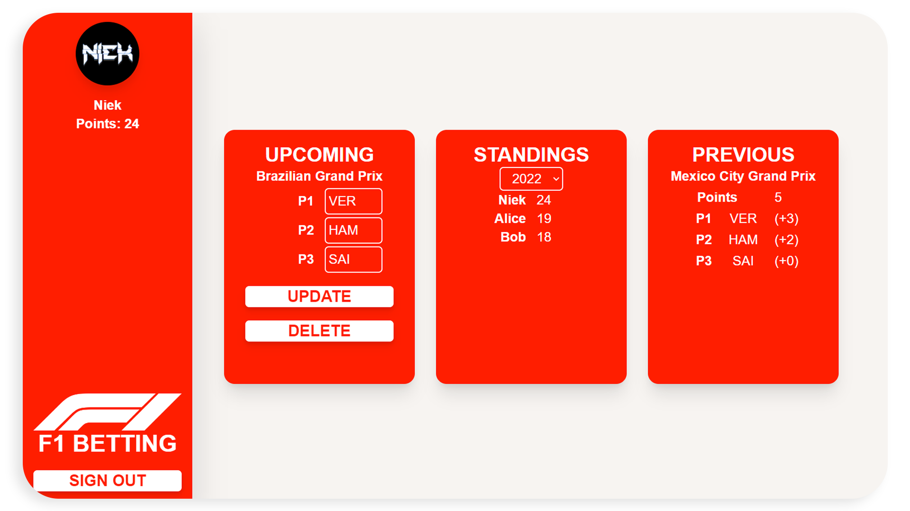

<a name="readme-top"></a>

<div>
<h3 align="center">F1FrontEnd</h3>

  <p align="center">
    A web application to do bets with your friends about F1 race results!
    <br />
    <a href="https://github.com/f1betting/F1FrontEnd/issues">Report Bug</a>
    ·
    <a href="https://github.com/f1betting/F1FrontEnd/issues">Request Feature</a>
  </p>
</div>


<!-- TABLE OF CONTENTS -->

## 📋 Table of contents

- [ℹ️ About The Project](#-about-the-project)
    - [🚧 Built With](#built-with)
- [🔨 Getting Started](#-getting-started)
    - [⚠ Prerequisites](#-prerequisites)
    - [🤖 .env file](#-env-file)
    - [🚢 Running using Docker](#-running-using-docker)
    - [🏡 Running development server](#-running-development-server)
    - [🏗️ Building the app](#-building-the-app)
- [🚀 Usage ](#-usage)
- [📜 License](#-license)

<!-- ABOUT THE PROJECT -->

## ℹ️ About The Project

A web application to do bets with your friends about F1 race results!

This is the front-end used to interact with [F1Betting](https://github.com/f1betting/F1Betting).

<p align="right">(<a href="#readme-top">back to top</a>)</p>

### 🚧 Built With

* [![Yarn]][Yarn-url]
* [![Vite]][Vite-url]
* [![Vue.js]][Vue.js-url]
* [![Typescript]][Typescript-url]
* [![Tailwind]][Tailwind-url]

<p align="right">(<a href="#readme-top">back to top</a>)</p>


<!-- GETTING STARTED -->

## 🔨 Getting Started

Below are the instructions for running the app for development and general usage.

### ⚠ Prerequisites

* [F1API](https://github.com/f1betting/F1API) must be running
* [F1Betting](https://github.com/f1betting/F1Betting) must be running
* A Google Cloud project with OAuth2 credentials configured

### 🤖 .env file

This project requires a ```.env``` file. Below is a template of the values it should contain.

````dotenv
# Google client ID
VITE_CLIENT_ID=

# URL to F1Betting (https://github.com/f1betting/F1Betting)
VITE_BETTING_API_URL=

# URL to F1API (https://github.com/f1betting/F1API)
VITE_F1_API_URL=

# SERVER SETTINGS
HOST=0.0.0.0
PORT=5173

# DEV | PROD
MODE=DEV
````

### 🚢 Running using Docker

Running the app using Docker requires a ```.env.prod``` file. The server settings should be set to

````dotenv
# SERVER SETTINGS
HOST=0.0.0.0
PORT=5173

# DEV | PROD
MODE=PROD
````

1. Build docker image using:

    ````shell
    $ docker build . -t f1frontend
    ````

2. Run container using:

    ````shell
    $ docker run -p 80:80 f1frontend
    ````

### 🏡 Running development server

Running the app using the development server requires a ```.env``` file. The server settings should be set to

````dotenv
# SERVER SETTINGS
HOST=0.0.0.0
PORT=5173

# DEV | PROD
MODE=DEV
````

1. Install dependencies with yarn using:

   ````shell
   $ yarn install
   ````

2. Run development server using:
   ````shell
   $ yarn dev --host
   ````

The server will be running on port ```5173```

### 🏗️ Building the app

1. Install dependencies with yarn using:

   ````shell
   $ yarn install
   ````

2. Build app using:
   ````shell
   $ yarn build
   ````

<p align="right">(<a href="#readme-top">back to top</a>)</p>


<!-- USAGE EXAMPLES -->

## 🚀 Usage



If running development server, it will be running on port ``5173``

Upon loading the app you will be prompted to log-in using Google.

Once you've signed in, the app will take you to the main screen. Here you can place bets, edit bets and delete bets. You
can also see the results for the previous race and view the standings per season.

To place a bet, click on one of the rectangles and start typing the driver abbreviation. They will be auto-completed as
you continue to type.

<p align="right">(<a href="#readme-top">back to top</a>)</p>


<!-- LICENSE -->

## 📜 License

Distributed under the MIT License. See `LICENSE.md` for more information.

<p align="right">(<a href="#readme-top">back to top</a>)</p>


<!-- MARKDOWN LINKS & IMAGES -->
<!-- https://www.markdownguide.org/basic-syntax/#reference-style-links -->

[Yarn]: https://img.shields.io/badge/yarn-%232C8EBB.svg?style=for-the-badge&logo=yarn&logoColor=white

[Yarn-url]: https://yarnpkg.com/

[Vite]: https://img.shields.io/badge/vite-%23646CFF.svg?style=for-the-badge&logo=vite&logoColor=white

[Vite-url]: https://vitejs.dev/

[Vue.js]: https://img.shields.io/badge/vuejs-%2335495e.svg?style=for-the-badge&logo=vuedotjs&logoColor=%234FC08D

[Vue.js-url]: https://vuejs.org/

[Typescript]: https://img.shields.io/badge/typescript-%23007ACC.svg?style=for-the-badge&logo=typescript&logoColor=white

[Typescript-url]: https://www.typescriptlang.org/

[Tailwind]: https://img.shields.io/badge/tailwindcss-%2338B2AC.svg?style=for-the-badge&logo=tailwind-css&logoColor=white

[Tailwind-url]: https://tailwindcss.com/
